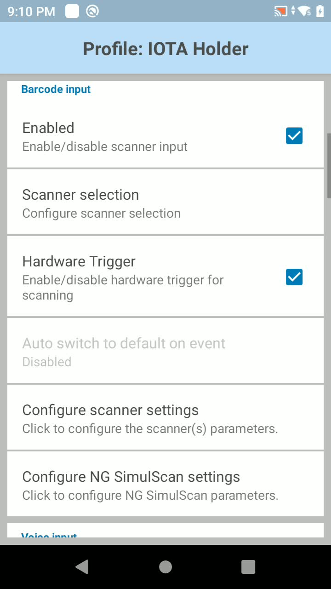
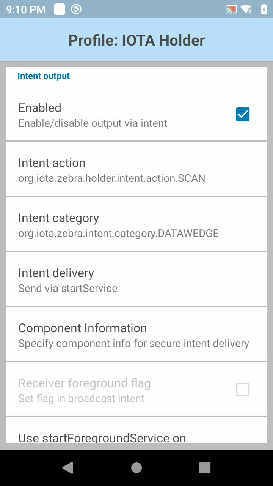
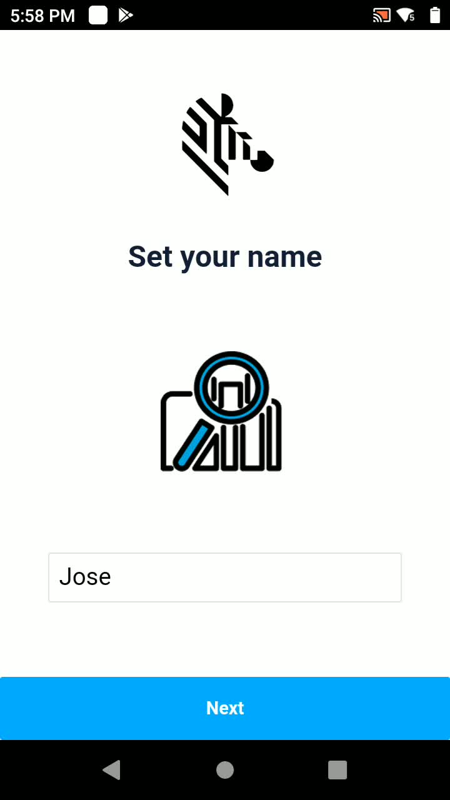
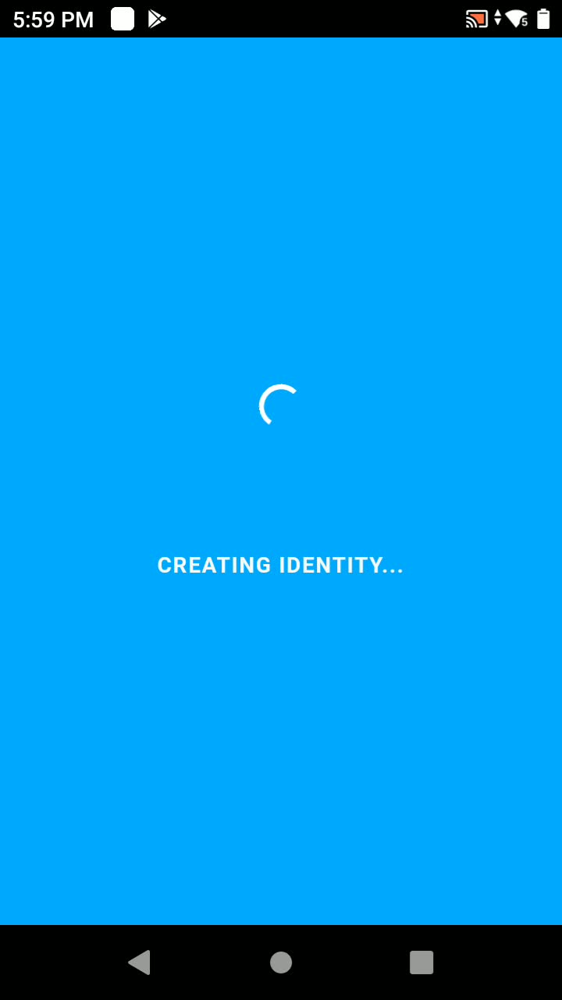
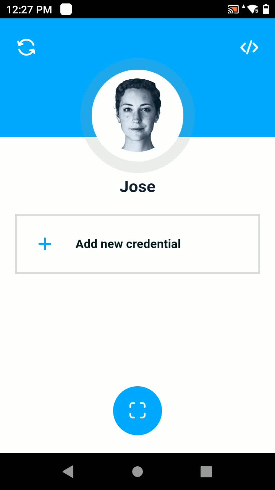
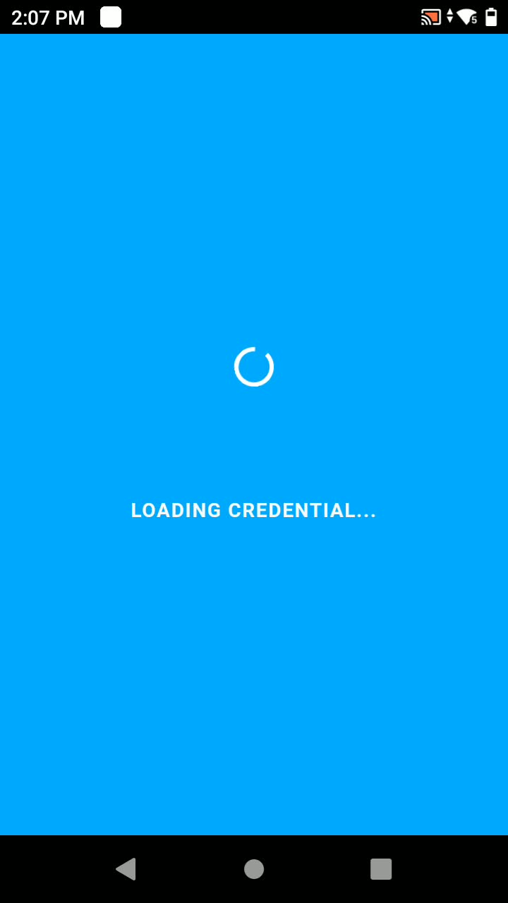
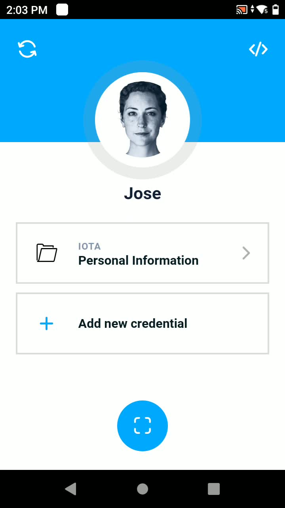
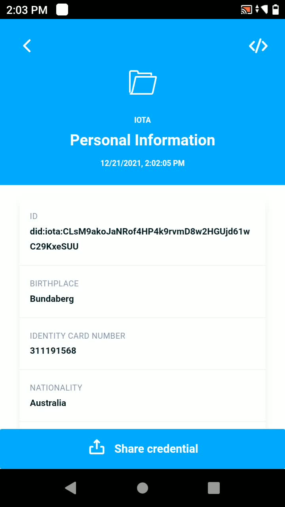
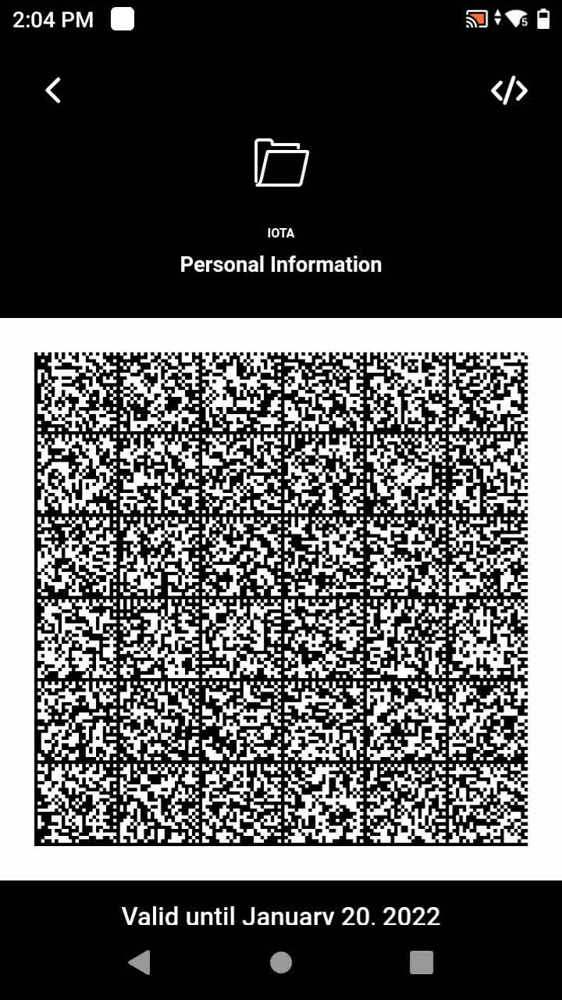
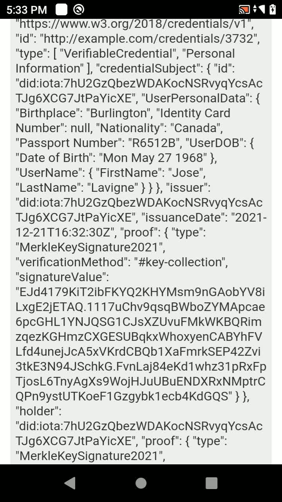

## Introduction

All the scaffolding needed to create a solution for managing credentials on Android devices is packaged under the so-called _Holder Application_. This application also allows sharing credentials with interested parties by way of a scannable data matrix.

The application guides the user to set up an Identity (a DID document) before associating Verifiable Credentials to this Identity. As this is just a reference application, the app self-signs the Verifiable Credentials, but ordinarily they would be signed by a third party such as a government in the case of personal details. An interested party can scan and verify the credential when presented in the form of a data matrix (see _[Verifier Tutorial](../103/zebra-iota-edge-sdk-103-tutorial.md)_ section).

Note: The _Holder Application_ also includes partial functionality as an issuer of credentials (see [DeviceID Tutorial](../104/zebra-iota-edge-sdk-104-tutorial.md)).

## How to run in a browser

Run the Holder application in your browser with the below commands:

```console
# Clone the repository
git clone https://github.com/ZebraDevs/Zebra-Iota-Edge-SDK

# Set up the project
cd Zebra-Iota-Edge-SDK/identity-enabler/holder-mobile-app
npm install

# Build and run
npm run start:dev

# Open http://localhost:5001 in your browser
```

## How to run on an Android Device

Before continuing please ensure that you have already installed the Android Studio on your local development machine and is properly configured. Then

```console
# Clone the repository
git clone https://github.com/ZebraDevs/Zebra-Iota-Edge-SDK

# Set up the project
cd Zebra-Iota-Edge-SDK/identity-enabler/holder-mobile-app
npm install

# Build and run
npm run android
```

Afterwards you need to go to the Android Studio and compile, install and execute the corresponding Android application. After successfully running the application you will be shown a simple wizard that you will need to complete. See below.

## DataWedge profile

In order to use the credential issuance part of this application (see [DeviceID tutorial](../104/zebra-iota-edge-sdk-104-tutorial-104.md#onboard-a-device)) you will need to set up a DataWedge profile bound to the `“org.iota.zebra.holder”` application as follows:

</img>
</img>
</img>

Note: On a non DataWedge device you can simulate a DataWedge scanning through the `adb` command line tool as follows:

```console
adb shell am startservice -a org.iota.zebra.holder.intent.action.SCAN -e com.symbol.datawedge.source scanner -e com.symbol.datawedge.data_string <scanned_string>
```

## Create an Identity

Under the first time experience wizard, once you enter a name associated with your new Identity, (last step of the wizard) the application will create a new DID, anchoring it to the IOTA Tangle. The private key that allows control of such an Identity is securely stored on the device.

</img>
</img>
</img>

### Show me the code

Below you can find the code that calls the IOTA Identity Framework and generates a new decentralized identity. As mentioned before, this code can be found under the [IdentityService](https://github.com/ZebraDevs/Zebra-Iota-Edge-SDK/blob/main/identity-enabler/holder-mobile-app/src/services/identityService.ts) class.

```typescript
import * as IotaIdentity from "@iota/identity-wasm/web";
const { Config, Network, Client, KeyPair, KeyType, Document, KeyCollection, VerificationMethod } = IotaIdentity;

// Initialize the library - Is cached after first initialization
await IotaIdentity.init();

// Create a client
const cfg = Config.fromNetwork(Network.try_from_name("main"));
cfg.setNode("https://chrysalis-nodes.iota.org");
cfg.setPermanode("https://chrysalis-chronicle.iota.org/api/mainnet");
const client = Client.fromConfig(cfg);

// Generate a new keypair and DID document
const key = new KeyPair(KeyType.Ed25519);
const doc = new Document(key, client.network().toString());

// Add a Merkle Key Collection method, so compromised keys can be revoked.
const keys = new KeyCollection(KeyType.Ed25519, 8);
const method = VerificationMethod.createMerkleKey(Digest.Sha256, doc.id, keys, "key-collection");
```

Afterwards a new DID Document will have been anchored to the IOTA Tangle mainnet similar to (Note: you will have a different one when you execute this tutorial)

```json
{
    "id": "did:iota:7mog3xHBBm6H5fHxRdMiaRMjDHaFZn1kQshd8CoVPJdZ",
    "verificationMethod": [
        {
            "id": "did:iota:7mog3xHBBm6H5fHxRdMiaRMjDHaFZn1kQshd8CoVPJdZ#authentication",
            "controller": "did:iota:7mog3xHBBm6H5fHxRdMiaRMjDHaFZn1kQshd8CoVPJdZ",
            "type": "Ed25519VerificationKey2018",
            "publicKeyMultibase": "z9wnY61277zU1xLg4TUXXz4ZBQRFudu1Ln52QFXSYEnXF"
        },
        {
            "id": "did:iota:7mog3xHBBm6H5fHxRdMiaRMjDHaFZn1kQshd8CoVPJdZ#key-collection",
            "controller": "did:iota:7mog3xHBBm6H5fHxRdMiaRMjDHaFZn1kQshd8CoVPJdZ",
            "type": "MerkleKeyCollection2021",
            "publicKeyMultibase": "z11m9xNVcEfLJcakvkQF8UkeyaFdfcyLPMvrU9qzBMEKqa"
        }
    ],
    "authentication": [
        "did:iota:7mog3xHBBm6H5fHxRdMiaRMjDHaFZn1kQshd8CoVPJdZ#authentication"
    ],
    "created": "2021-12-21T11:27:10Z",
    "updated": "2021-12-21T11:27:10Z"
}
```

The document contains two verification methods, one used for authentication purposes (i.e for modifying the content of the DID document) and the other could be used for issuing new credentials. The latter is based on a [Merkle Tree](https://en.wikipedia.org/wiki/Merkle_tree) of multiple key pairs that facilitates the revocation of credentials when needed. It is noteworthy that from now on, this DID document will be publicly auditable and could be used to verify credentials issued by the DID `did:iota:7mog3xHBBm6H5fHxRdMiaRMjDHaFZn1kQshd8CoVPJdZ. `

Note: You can always inspect a DID document by using the IOTA Identity Resolver, for instance, at [https://explorer.iota.org/mainnet/identity-resolver/did:iota:7mog3xHBBm6H5fHxRdMiaRMjDHaFZn1kQshd8CoVPJdZ](https://explorer.iota.org/mainnet/identity-resolver/did:iota:7mog3xHBBm6H5fHxRdMiaRMjDHaFZn1kQshd8CoVPJdZ) . In addition you can also resolve DID documents (and also generate them) using the [tangle-cli](https://www.npmjs.com/package/@tangle-js/tangle-cli) command line interface tool, for instance

```console
tcli did resolve –mainnet –did=did:iota:7mog3xHBBm6H5fHxRdMiaRMjDHaFZn1kQshd8CoVPJdZ
```

In addition, the private key materials associated with the identity are [securely stored](https://github.com/ZebraDevs/Zebra-Iota-Edge-SDK/blob/main/identity-enabler/holder-mobile-app/src/pages/Name.svelte#L49) on the device.

## Self-issue a new credential {#self-issue-a-new-credential}

Now that we have an anchored Identity, we can issue a new Credential containing claims about it. For demonstration purposes the _Holder Application_ is capable of self-issuing credentials, thus playing also the role of an Issuer. Please note that, indeed, **in a real use case there would be a separate issuer application and credentials will not be self-signed.**

For self-issuing a new credential, click on the “_Add new Credential_” button. Immediately a new Credential, which subject will be equal to its issuer, will be signed and generated. The reference application is capable of issuing personal credentials (Government ID cards, health passports, etc.). However, it can also be easily extended to support other kinds of credentials, for instance, for organizations or devices along supply chains.

Note: The user is both the subject and the holder of the identity and credentials created in this app.

Note: At any point in time you can click on the button on top left of the main page of the application and restart the process of identity and credentials generation.

</img>
</img>
</img>

### Show me the code

The issuance of a new credential is performed using the IOTA Identity implementation of the W3C Verifiable Credentials standard. It means that credentials are represented using JSON-LD and can make use of standard vocabularies such as [schema.org](https://schema.org) for representing claims. The claims contained within a credential (the `data` field in the code below) are just randomly generated for educational purposes.

The code below shows how this process can be implemented. The verification method used to generate our new credential is the one corresponding to the aforementioned Merkle keyset, concretely using the key at the index 0 of such keyset.

```typescript
    const IssuerDidDoc = Document.fromJSON(JSON.parse(issuer.didDoc));
    const IssuerKeys = KeyCollection.fromJSON(issuer.keys);
    const IssuerDoc = Document.fromJSON(issuer.doc);
    const IssuerMethod = VerificationMethod.fromJSON(issuer.method);

    // Prepare a credential subject
    const credentialSubject = {
        id: IssuerDidDoc.id.toString(),
        ...data
    };

    // Issue an unsigned credential
    const unsignedVc = VerifiableCredential.extend({
        id: "http://example.com/credentials/3732",
        type: schemaName,
        issuer: IssuerDidDoc.id.toString(),
        credentialSubject
    });

    // Sign the credential with User's Merkle Key Collection method
    const signedVc = IssuerDoc.signCredential(unsignedVc, {
        method: IssuerMethod.id.toString(),
        public: IssuerKeys.public(0),
        private: IssuerKeys.private(0),
        proof: IssuerKeys.merkleProof(Digest.Sha256, 0)
    });
```

As a result, a new Verifiable Credential will be generated and stored on the device. An example that shows the structure of a Verifiable Credential can be found [here](https://www.w3.org/TR/vc-data-model/#example-a-simple-example-of-a-verifiable-credential). It is a standard JSON-LD document using the vocabulary and data model defined by the W3C standard, which includes fields devoted to the signature (proof) and related metadata.

## Present a credential

The last but not least functionality that any holder application should offer is the possibility to present a credential. The presentation of a credential consists of the generation of a new signed JSON-LD document (named as Verifiable Presentation) that wraps the original credential document together with a signature generated with a private key of the holder of the credential.

As a result the verifier can validate not only the credential itself, but also the identity of who is presenting the credential (the holder). In our example, the holder, the issuer and the subject of the credential all correspond to the same identity.

Once a verifiable presentation has been generated it is encoded using a data matrix code. In our example we are using a 6 by 6 data matrix code that can later be scanned by the _Verifier Application_ (see below). If you double tap on the data matrix code you will be able to inspect the JSON-LD content that represents the credential presented.

</img>
</img>

### Show me the code

Generating and signing a Verifiable Presentation is done using the following code snippet

```typescript
    // Prepare presentation Data
    const IssuerKeys = KeyCollection.fromJSON(issuer.keys);
    const IssuerDoc = Document.fromJSON(issuer.doc);
    const IssuerMethod = VerificationMethod.fromJSON(issuer.method);

    // Create a Verifiable Presentation from the Credential - signed by user's key
    const unsignedVp = new VerifiablePresentation(IssuerDoc, signedVc);

    const signedVp = IssuerDoc.signPresentation(unsignedVp, {
        method: IssuerMethod.id.toString(),
        public: IssuerKeys.public(0),
        private: IssuerKeys.private(0),
        proof: IssuerKeys.merkleProof(Digest.Sha256, 0)
    });
```

Then, the generation of a data matrix code is done using the [https://github.com/metafloor/bwip-js](https://github.com/metafloor/bwip-js) library.

## Next Steps

If you want to know how to build an application capable of verifying credentials go the [103 Tutorial](../103/zebra-iota-edge-sdk-103-tutorial.md)
