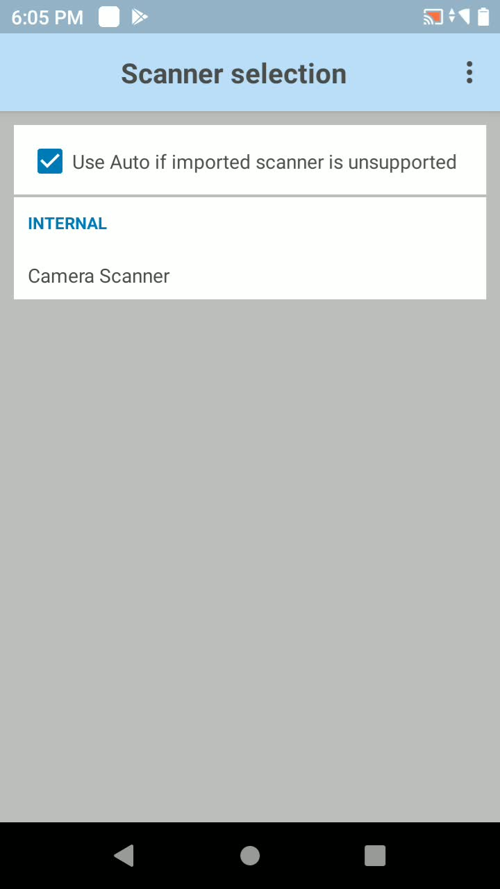
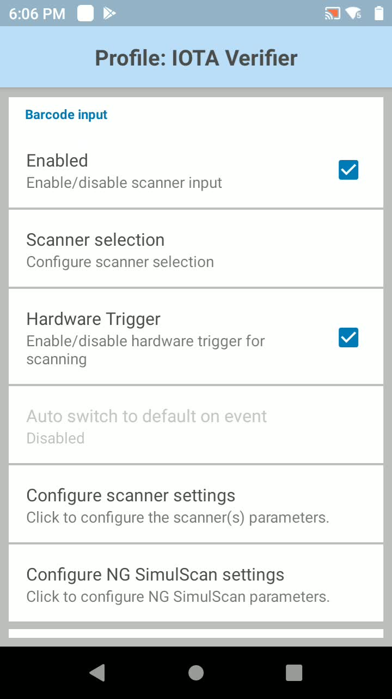
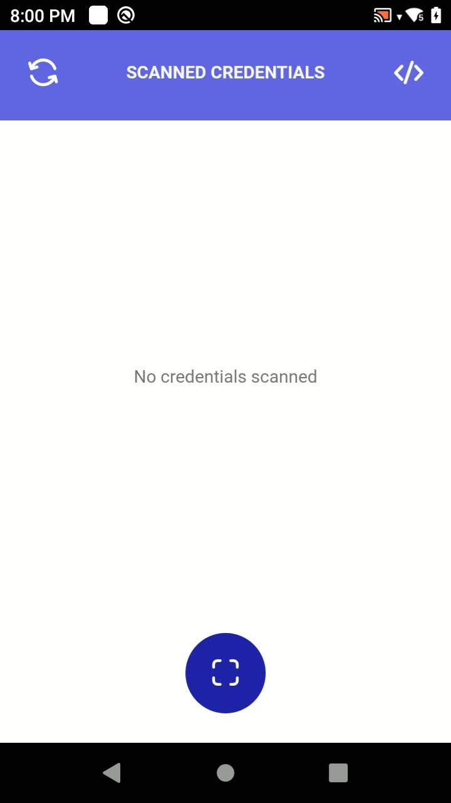
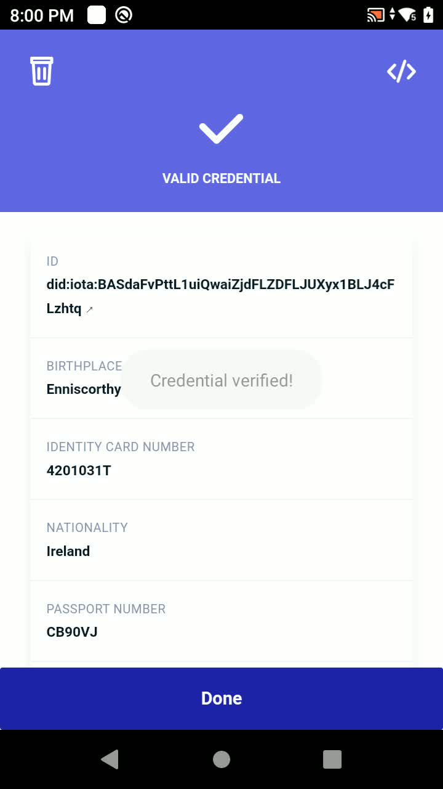
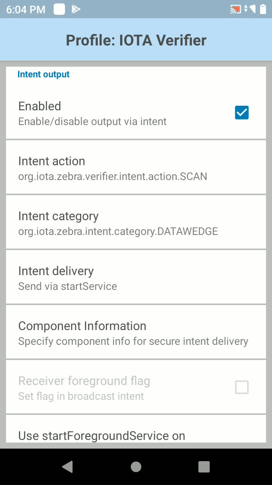
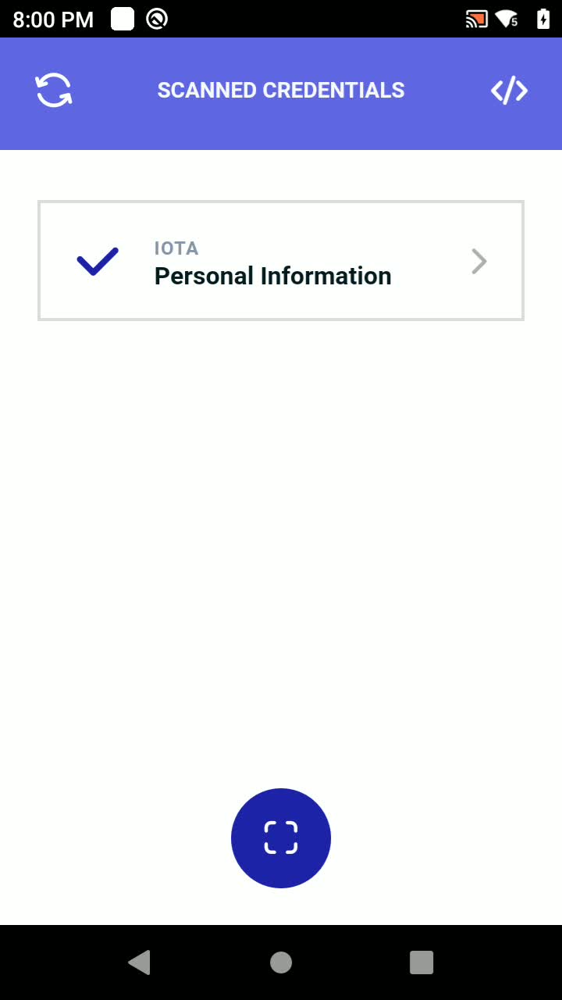

# Zebra-IOTA-Edge-SDK : Identity Enabler : 101 Tutorial

In this tutorial you will learn how to use the **Identity Enabler** of the Zebra-IOTA Edge SDK to issue, verify and manage decentralized and interoperable identities for people, organizations and devices. If you are already familiar with the IOTA Tangle and / or the concepts behind Decentralized Identity you can jump directly to the [tutorial](#tutorial).

## Introduction {#introduction}

### Digital Identities {#digital-identities}

Based on its [technical definition](https://www.justaskgemalto.com/en/what-is-digital-identity/) a **digital identity** “is the information on an entity used by computer systems to represent an external agent. That agent may be a person, organization, application, or device.”

The details collected about an identity (for example name, email address, DoB, credit card number, vaccinations taken for personal identities) during the identity creation phase represent what are called the **identity claims**. An identity is associated with zero, one or multiple claims.

<p id="gdcalert1" ><span style="color: red; font-weight: bold">>>>>>  gd2md-html alert: inline image link here (to images/image1.png). Store image on your image server and adjust path/filename/extension if necessary. </span><br>(<a href="#">Back to top</a>)(<a href="#gdcalert2">Next alert</a>)<br><span style="color: red; font-weight: bold">>>>>> </span></p>


Different roles can be distinguished (see figure above):

- Identity **Subject**. The agent in question (person, organization, device, …).
- Identity **Holder**. The entity that presents an identity, (usually the Identity Subject) to a Verifier (see below).
- Identity **Issuer**. The entity that, after verifying the identity claims made (with a process usually named _Know Your Customer, KYC_), issues an identity, for instance, the public authorities when it comes to national IDs or vaccination certificates.
- Identity **Verifier**: The entity that verifies the authenticity of an identity presented by a Holder. For instance, a restaurant verifying a health passport to grant admission to the holder.

Once an identity is issued it can be used to access a number of services that accept that identity. These services are therefore able to verify that the presented identity exists and it is authentic. In case this ability to verify a given identity is only accessible to the original identity issuer, the digital identity is called a _centralized digital identity_. An example of this is the identity that our Internet Provider issued to us (through a username and password) to access the Internet and to pay our bills online.

### Decentralized Digital Identities {#decentralized-digital-identities}

There are novel application scenarios where a subject has to prove its own identity and check those of other parties in the context of **heterogeneous** and global, distributed application services. This requires that the subject’s digital identity and claims are verified without the need to create new digital identities (one for each service or geography) and to repeat the different issuance and claim verification process.

This requires the creation of a new model for issuing and verifying digital identities. A model that allows any verifier to verify subject’s identities issued by different issuers and that _avoids duplication_ in the creation of verified claims. And this is where **Decentralized Identities** come into play.

Decentralized digital identities (DIDs) are a new type of digital identities that allow for the creation of identity and their claims verification in a decentralized way. This does not require any one to one integration between identity issuers and identity verifiers. As a result DIDs allow for high scalability and reduction of time and costs, as claims already proofed against a given identity issuer are not required to be proofed again against a different one (e.g. a company operating in a different country).

DIDs build on basic principles:

- Identity and its claims are controlled by the Identity Holder, which is usually equal to the Identity Subject;
- Identity Verifiers rely on digital signatures to trust the authority of Identity Issuers and the claims that they verify;
- Verified claims about the Identity Subject are issued in the form of digital certificates signed by Identity Issuers and can be stored directly by the subject/holder;
- The public key cryptographic materials are anchored to a Distributed Ledger (such as IOTA) to ensure multiple stakeholders access and self-sovereign control on them.
- Acting as Issuer, Subject, Holder, or Verifier requires neither registration nor approval by any authority, as the trust involved is bilateral between parties.

### Applications of Decentralized Identities {#applications-of-decentralized-identities}

There are several applications of decentralized identities in different domains:

- **Personal Information Management**: The main application is self-sovereign identities as a privacy improvement. In fact, self-sovereign identities allow individuals to manage their identities (securely stored on their devices) without the intervention of a central authority or issuer. For instance, health credentials could be verified by a restaurant without interacting with a government service endpoint. For a more detailed description of this domain of application, please check the [IOTA-Zebra joint whitepaper](https://github.com/JamesSwinton/Zebra-IOTA-VerifiableCredentials/blob/main/Papers/IOTA%20-%20HealthPass%20-%20adoption%20paper.pdf) on health passports and the summary in this [blogpost](https://blog.iota.org/digital-green-certificates-a-decentralized-and-interoperable-infrastructure/).
- **Trade Certificates**: Verifiable claims anchored to decentralized identities can be used to represent digitally different kinds of certificates associated with trade items. For instance:
  - A phytosanitary certificate is waived to allow entrance of a foreign shipment through a customs post.
  - An Electric Vehicle Battery testing certificate is presented by a manufacturer to make claims about the testing made, thus guaranteeing and committing to a proper functioning of the device within a certain timeframe.
  - An organisation seeking to prove compliance of a product to certain quality standards can request for certification by a third-party auditor by means of a certificate associated with the product. Subsequently, a customer may verify the certificate as well as the issuing auditor’s identity independently. The identities of the organisations, products and possibly the customer are represented by a Decentralised Identity over which they have full ownership.
- **Decentralized Identity (DID) for Organizations**: The main application is the “DID for organizations in global trade” use case. For instance, a trader from Kenya creates its decentralized digital identity (DID) and receives a number of Credentials from Kenyan authorities after the requested verification processes. Some of these Credentials are also accepted by the EU authorities. Once starting to trade in Argentina, the same trader does not require new credentials as the existing ones are already matching those required by the Argentinian authorities, who can verify their authenticity in a decentralized way, without the need to integrate with any of the Kenya or EU Identity Issuers. You can watch this video which shows how we are applying it to the [TLIP Project](https://www.youtube.com/watch?v=bnAfclXTaeI) jointly developed by TradeMark East Africa and IOTA.
- **Decentralized Device Identity**. Any device, such as a printer, scanner or RFID reader used in supply chains, may be issued a decentralized identity and associated credentials by the organization owning it. As a result all interactions made with that device can be recorded and audited, increasing the level of traceability, accountability, security and trust in the daily operations of an organization. For instance, a Zebra scanner in a warehouse can be assigned a decentralized identity, including certain verifiable credentials. When the device generates supply chain events, for instance scanning trade items (pallets, cases, etc.), a new record, signed with the keys bound to the identity of such a device, can be recorded and anchored to a distributed ledger such as IOTA. As a result, any associated business operation could be traceable all the way from an origin device to the corresponding business transaction. The Zebra-IOTA SDK already includes a reference application (_[DeviceID Application](#tutorial-part-3-identity-for-devices-deviceid-application)_) structured around a wizard that allows onboarding devices owned by an organization (see below).
- **Supply Chain Credentials**. Currently there are many supply chain processes that are actually conducted without the proper level of security or with no digitisation at all. We can imagine a truck driver arriving into a warehouse requesting to load / unload some pallets and showing just a document on paper with the transportation order. These kind of processes involve identity, trust and change of custody records between multiple parties each one holding their own decentralized identity: the warehouse manager, the truck driver, the logistics service provider, the supplier company and the customer company, for instance:
  - The logistics service provider has to issue a credential to the truck driver so that he is authorized to transport certain pallets
  - The truck driver needs to present a credential to the warehouse manager conveying that he is entitled to load/unload the right pallets
  - The warehouse manager needs to verify the truck’s driver credential to allow the load / unload
  - The logistics service provider needs to prove that the goods were loaded and later delivered to the customer
  - The supplier needs to prove that the goods were handed over to the logistics service provider and later received to the customer

As the amount of stakeholders and their interrelationships can be huge, the only viable

    solution to these problems is the usage of decentralized identities. The Zebra-IOTA Edge SDK already provides application blueprints that can be extended to meet the scenarios described above.

### DLT Technologies and IOTA {#dlt-technologies-and-iota}

A Ledger is an information store that keeps final and definitive (immutable) records of transactions. A Distributed Ledger is a type of ledger that is shared, replicated, and synchronized in a distributed and decentralized manner. A decentralised system is a system wherein control is shared among the persons or organizations participating in the operation of the system.

IOTA is an open source, scalable and permissionless DLT that enables sharing of data guaranteeing traceability of their source, alongside with integrity and immutability of the shared information, and dedicated access management, e.g., who can read what. This is possible using complementary frameworks such as the [IOTA Identity Framework](https://blog.iota.org/iota-identity-beta-release/).

In contrast with traditional blockchain-based DLTs, IOTA is based on a Directed Acyclic Graph, the Tangle. [This video](https://www.youtube.com/watch?v=ivWqqfzunhI) explains how IOTA's Tangle works. [Here](https://wiki.iota.org) you can find a get started guide intended for IOTA's developers with additional references.

### The IOTA Identity Framework {#the-iota-identity-framework}

The IOTA Identity Framework is an implementation of the W3C Decentralized Identity standards leveraging IOTA Tangle. Such standards are composed of two different specifications:

- [DID specification](https://www.w3.org/TR/did-core/). Defines a new URI scheme, the **did** scheme, that allows associating dereferenceable URIs to identities. In addition, the specification defines the syntax and structure of a JSON document, the DID document, that contains all the cryptographic materials or metadata associated with an identity identified by a DID URI. Such a JSON document is the result of dereferencing the DID URI.

  Different DID methods can be defined, being “iota” one of them, which allows anchoring a DID document to the IOTA Distributed Ledger and managing all its lifecycle (creation, retrieval, update, etc.).

  For instance, `did:iota:GDCYuLMc14aCuxQXTJ8a4Rdw93WYH19oqTXiDCES4VvE` is an example of IOTA DID. You can view the associated DID document at [https://explorer.iota.org/mainnet/identity-resolver/did:iota:GDCYuLMc14aCuxQXTJ8a4Rdw93WYH19oqTXiDCES4VvE](https://explorer.iota.org/mainnet/identity-resolver/did:iota:GDCYuLMc14aCuxQXTJ8a4Rdw93WYH19oqTXiDCES4VvE) . As you can see the most important part of a DID document are the verification methods which contain public keys that can be later used to verify credentials or signatures in general.

  Using the IOTA Identity library one can create and later retrieve (by dereferencing the DID URI) these documents and point to specific parts of it, for instance specific public keys that can be used to verify credentials issued by the entity controlling the DID.

- [Verifiable Credentials](https://www.w3.org/TR/vc-data-model/) specification. Defines a JSON(-LD) document format to represent credentials issued by an entity (identified by a DID) to a certain subject (identified by another DID). Those credentials contain several claims represented by JSON-LD properties and values. In addition, a Verifiable Credential contains other metadata such as the issuance or expiration date and the verifiable signature of the issuer, that can be used by the verifier to check for its authenticity. The IOTA Identity Framework provides a library that facilitates the issuance and verification of W3C Verifiable Credentials.

The IOTA Identity framework handles all the interactions with the IOTA Tangle where the DID documents are published and anchored to. In the context of Verifiable Credentials, the Tangle acts as the _Verifiable Data Registry_. The IOTA Tangle is well-suited as it provides guarantees of data integrity and immutability and, therefore, trust between participating parties but without incurring any fees.

The IOTA Identity Framework is coded in [Rust](https://github.com/iotaledger/identity.rs) but has also defined WASM (Javascript) bindings which facilitate its usage to Mobile and Web Developers. In fact, the Zebra Edge SDK is using those bindings to implement the functionality described by this tutorial.

## The Zebra-IOTA Edge SDK: Overview {#the-zebra-iota-edge-sdk-overview}

The Zebra-IOTA Edge SDK is composed of different open source modules (enablers) that facilitate the creation of applications that exploit IOTA’s DLT capabilities on edge devices, in particular Zebra Devices. The enabler described by this tutorial (_Identity Enabler_) is the one corresponding to decentralized identities. It is based on the IOTA Identity Framework and makes it easier to develop solutions on the edge that exploit the capabilities of decentralized identities for people, devices or organizations.

The Identity Enabler is composed of a set of **reference applications** that can be used as a \_scaffold / blueprint \_for developers, and as guidance on how to solve the most common problems around decentralized identity, such as credential issuance or verification using the APIs offered by the IOTA Identity Framework.

The SDK uses Web Technologies for the user interface of the aforementioned reference applications. In particular, those applications are coded in [TypeScript](https://www.typescriptlang.org/), using the [Svelte framework](https://svelte.dev). To package the Web Applications as Android applications, the [Capacitor framework](https://capacitorjs.com/) is used. That means that you can run these applications in your favourite browser as Web Applications or in your Android device or emulator.

## Tutorial {#tutorial}

### Prerequisites {#prerequisites}

In order to follow this tutorial and experiment with the Zebra Edge SDK Identity Enabler you would need the following software artefacts installed on your local development environment:

- [Node.js](https://nodejs.org/en/download/)
- [Npm](https://docs.npmjs.com/downloading-and-installing-node-js-and-npm) or yarn package managers
- [Android Studio](https://developer.android.com/studio)
- Android development tools: [adb](https://developer.android.com/studio/command-line/adb) command line tool, Android emulator ([AVD](https://developer.android.com/studio/run/managing-avds))
- Ideally a Zebra Android device equipped with camera/scanning capabilities and the [DataWedge](https://techdocs.zebra.com/datawedge/11-1/guide/about/) connector. This tutorial has been developed using the [TC21](https://www.zebra.com/gb/en/products/mobile-computers/handheld/tc21-tc26.html) device executing Android 10. It also has been tested with an old regular Android 5.1.1 device.
- The codebase has been tested using the Android System Webview runtimes corresponding to versions 95 (on the Android 5.1.1) and 96 (TC21).
- DataWedge profiles for the different applications. They can be downloaded from [here](https://github.com/ZebraDevs/Zebra-Iota-Edge-SDK/blob/main/test/datawedge/datawedge.db) and then imported into your own Zebra device. The profile for each application shall be configured as follows:
  - Intent Output: Enabled
  - Intent Action: `org.iota.zebra.&lt;verifier|holder|device_id>.intent.action.SCAN`
  - Intent category: `org.iota.zebra.intent.category.DATAWEDGE`
  - Intent delivery: Send via \*\*<code>startService</code></strong>

In the case of the TC21 device we deliberately updated the Android System Webview runtime to version 96. Despite being restricted from Google Play, we managed to install it manually through this [portal](https://www.apkmirror.com/apk/google-inc/android-system-webview/android-system-webview-96-0-4664-104-release/android-system-webview-96-0-4664-104-4-android-apk-download/) (please note that <strong>64 bit</strong> <strong>ARM</strong> versions should be downloaded).

If you are going to extend the reference applications, or develop your own applications we recommend that you install the [VSCode](https://code.visualstudio.com/) environment together with the following plugins:

- Prettier: [https://marketplace.visualstudio.com/items?itemName=esbenp.prettier-vscode](https://marketplace.visualstudio.com/items?itemName=esbenp.prettier-vscode)
- Svelte: [https://marketplace.visualstudio.com/items?itemName=svelte.svelte-vscode](https://marketplace.visualstudio.com/items?itemName=svelte.svelte-vscode)
- ES Lint: [https://marketplace.visualstudio.com/items?itemName=dbaeumer.vscode-eslint](https://marketplace.visualstudio.com/items?itemName=dbaeumer.vscode-eslint)

If you want to do a more exhaustive debugging you can use the adb command line tool:

```
$ adb logcat | grep -F "`adb shell ps | grep org.iota.zebra | tr -s [:space:] ' ' | cut -d' ' -f2`"
```

### Getting started {#getting-started}

Under the[ identity-enabler](https://github.com/ZebraDevs/Zebra-Iota-Edge-SDK) folder, there is one subfolder for each of the reference applications. For each application the `src` directory contains the `pages` and `modal` directories containing the application-specific Svelte page and modal window components. Additionally, each application has a `config.ts` file with settings and contains an Android application in the `android` directory.

```
.
├── identity-enabler
│   ├── deviceId-mobile-app
│   │   ├── android
│   │   │   ├── app
│   │   │   └── gradle
│   │   └── src
│   │   	├── modal
│   │   	└── pages
│   ├── holder-mobile-app
│   │   ├── android
│   │   │   ├── app
│   │   │   └── gradle
│   │   └── src
│   │   	├── modal
│   │   	└── pages
│   └── verifier-mobile-app
│   	  ├── android
│   	  │   ├── app
│   	  │   └── gradle
│   	  └── src
│       	├── modal
│       	└── pages
```

The specific code that deals with the IOTA Identity framework is at the [IdentityService](https://github.com/ZebraDevs/Zebra-Iota-Edge-SDK/blob/dev/identity-enabler/verifier-mobile-app/src/services/identityService.ts) wrapper class. We will explain the specific details of that class under the corresponding application tutorial section. In addition there is a “show me the code” button on each application screen that you can use to find relevant code snippets in context.

During the tutorial we will explain how the applications can make use of the [IOTA Identity](https://github.com/iotaledger/identity.rs) Framework to solve the decentralized identity functionalities. However, we will not explain the details concerning the implementation of the user interface through the Svelte Framework. Nonetheless, we can recommend this [Svelte tutorial](https://svelte.dev/tutorial/).

Last but not least, the SDK solves the problem of bridging [Zebra DataWedge](https://techdocs.zebra.com/datawedge/11-1/guide/about/) and the Web Application code. The main idea is that there is a [DataWedge service ](https://github.com/ZebraDevs/Zebra-Iota-Edge-SDK/blob/dev/identity-enabler/verifier-mobile-app/android/app/src/main/java/org/iota/zebra/verifier/datawedge/DataWedgeService.java)that is awakened whenever a new DataWedge intent is triggered (if properly configured through a DataWedge profile as previously explained). Afterwards, the Service triggers a data observation event (with the scanned string) to the [main Android Activity](https://github.com/ZebraDevs/Zebra-Iota-Edge-SDK/blob/dev/identity-enabler/verifier-mobile-app/android/app/src/main/java/org/iota/zebra/verifier/MainActivity.java#L64) which receives it and executes the <code>[onScan](https://github.com/ZebraDevs/Zebra-Iota-Edge-SDK/blob/main/identity-enabler/verifier-mobile-app/src/App.svelte#L22)</code> method at the Web View. Such a method will react to the scanned data accordingly. For those devices which do not incorporate a scanner with DataWedge capabilities, the scanning can proceed through the regular device’s camera (open through the [Media Device Web APIs](https://developer.mozilla.org/en-US/docs/Web/API/MediaDevices/getUserMedia)) and the [https://github.com/zxing-js/library](https://github.com/zxing-js/library) library. For that purpose there is a Svelte [Scanner](https://github.com/ZebraDevs/Zebra-Iota-Edge-SDK/blob/main/identity-enabler/verifier-mobile-app/src/components/Scanner.svelte) component and a Svelte [Scan](https://github.com/ZebraDevs/Zebra-Iota-Edge-SDK/blob/main/identity-enabler/verifier-mobile-app/src/pages/Scan.svelte) page that can be easily reused.

## Tutorial Part 1 .- Managing credentials (Holder Application) {#tutorial-part-1-managing-credentials-holder-application}

### Introduction {#introduction}

All the scaffolding needed to create a solution for managing credentials on Android devices is packaged under the so-called _Holder Application_. This application also allows sharing credentials with interested parties by way of a scannable data matrix.

The application guides the user to set up an Identity (a DID document) before associating Verifiable Credentials to this Identity. As this is just a reference application, the app self-signs the Verifiable Credentials, but ordinarily they would be signed by a third party such as a government in the case of personal details. An interested party can scan and verify the credential when presented in the form of a data matrix (see _[Verifier Application](#tutorial-part-2-verifying-credentials-verifier-application)_ section).

Note: The _Holder Application_ also includes partial functionality as an issuer of credentials (see the

<p id="gdcalert2" ><span style="color: red; font-weight: bold">>>>>>  gd2md-html alert: undefined internal link (link text: "DeviceID"). Did you generate a TOC? </span><br>(<a href="#">Back to top</a>)(<a href="#gdcalert3">Next alert</a>)<br><span style="color: red; font-weight: bold">>>>>> </span></p>

[DeviceID](#heading=h.wz9g209oc21j) section).

### How to run in a browser {#how-to-run-in-a-browser}

Run the Holder application in your browser with the below commands:

```
# Clone the repository
git clone https://github.com/ZebraDevs/Zebra-Iota-Edge-SDK

# Set up the project
cd Zebra-Iota-Edge-SDK/identity-enabler/holder-mobile-app
npm install

# Build and run
npm run start:dev

# Open http://localhost:5001 in your browser
```

### How to run on an Android Device {#how-to-run-on-an-android-device}

Before continuing please ensure that you have already installed the Android Studio on your local development machine and is properly configured. Then

```
# Clone the repository
git clone https://github.com/ZebraDevs/Zebra-Iota-Edge-SDK

# Set up the project
cd Zebra-Iota-Edge-SDK/identity-enabler/holder-mobile-app
npm install

# Build and run
npm run android
```

Afterwards you need to go to the Android Studio and compile, install and execute the corresponding Android application. After successfully running the application you will be shown a simple wizard that you will need to complete. See below.

### DataWedge profile {#datawedge-profile}

In order to use the credential issuance part of this application (see [DeviceID section](#onboard-a-device)) you will need to set up a DataWedge profile bound to the “org.iota.zebra.holder” application as follows:

<p id="gdcalert3" ><span style="color: red; font-weight: bold">>>>>>  gd2md-html alert: inline image link here (to images/image2.png). Store image on your image server and adjust path/filename/extension if necessary. </span><br>(<a href="#">Back to top</a>)(<a href="#gdcalert4">Next alert</a>)<br><span style="color: red; font-weight: bold">>>>>> </span></p>


<p id="gdcalert4" ><span style="color: red; font-weight: bold">>>>>>  gd2md-html alert: inline image link here (to images/image3.png). Store image on your image server and adjust path/filename/extension if necessary. </span><br>(<a href="#">Back to top</a>)(<a href="#gdcalert5">Next alert</a>)<br><span style="color: red; font-weight: bold">>>>>> </span></p>



<p id="gdcalert5" ><span style="color: red; font-weight: bold">>>>>>  gd2md-html alert: inline image link here (to images/image4.png). Store image on your image server and adjust path/filename/extension if necessary. </span><br>(<a href="#">Back to top</a>)(<a href="#gdcalert6">Next alert</a>)<br><span style="color: red; font-weight: bold">>>>>> </span></p>


Note: On a non DataWedge device you can simulate a DataWedge scanning through the adb command line tool as follows:

```
$ adb shell am startservice -a org.iota.zebra.holder.intent.action.SCAN -e com.symbol.datawedge.source scanner -e com.symbol.datawedge.data_string <scanned_string>
```

### Create an Identity {#create-an-identity}

Under the first time experience wizard, once you enter a name associated with your new Identity, (last step of the wizard) the application will create a new DID, anchoring it to the IOTA Tangle. The private key that allows control of such an Identity is securely stored on the device.

<p id="gdcalert6" ><span style="color: red; font-weight: bold">>>>>>  gd2md-html alert: inline image link here (to images/image5.png). Store image on your image server and adjust path/filename/extension if necessary. </span><br>(<a href="#">Back to top</a>)(<a href="#gdcalert7">Next alert</a>)<br><span style="color: red; font-weight: bold">>>>>> </span></p>


<p id="gdcalert7" ><span style="color: red; font-weight: bold">>>>>>  gd2md-html alert: inline image link here (to images/image6.png). Store image on your image server and adjust path/filename/extension if necessary. </span><br>(<a href="#">Back to top</a>)(<a href="#gdcalert8">Next alert</a>)<br><span style="color: red; font-weight: bold">>>>>> </span></p>


<p id="gdcalert8" ><span style="color: red; font-weight: bold">>>>>>  gd2md-html alert: inline image link here (to images/image7.png). Store image on your image server and adjust path/filename/extension if necessary. </span><br>(<a href="#">Back to top</a>)(<a href="#gdcalert9">Next alert</a>)<br><span style="color: red; font-weight: bold">>>>>> </span></p>



#### Show me the code {#show-me-the-code}

Below you can find the code that calls the IOTA Identity Framework and generates a new decentralized identity. As mentioned before, this code can be found under the [IdentityService](https://github.com/ZebraDevs/Zebra-Iota-Edge-SDK/blob/main/identity-enabler/holder-mobile-app/src/services/identityService.ts) class.

```
import * as IotaIdentity from "@iota/identity-wasm/web";
const { Config, Network, Client, KeyPair, KeyType, Document, KeyCollection, VerificationMethod } = IotaIdentity;

// Initialize the library - Is cached after first initialization
await IotaIdentity.init();

// Create a client
const cfg = Config.fromNetwork(Network.try_from_name("main"));
cfg.setNode("https://chrysalis-nodes.iota.org");
cfg.setPermanode("https://chrysalis-chronicle.iota.org/api/mainnet");
const client = Client.fromConfig(cfg);

// Generate a new keypair and DID document
const key = new KeyPair(KeyType.Ed25519);
const doc = new Document(key, client.network().toString());

// Add a Merkle Key Collection method, so compromised keys can be revoked.
const keys = new KeyCollection(KeyType.Ed25519, 8);
const method = VerificationMethod.createMerkleKey(Digest.Sha256, doc.id, keys, "key-collection");
```

Afterwards a new DID Document will have been anchored to the IOTA Tangle mainnet similar to (Note: you will have a different one when you execute this tutorial)

```
{
    "id": "did:iota:7mog3xHBBm6H5fHxRdMiaRMjDHaFZn1kQshd8CoVPJdZ",
    "verificationMethod": [
        {
            "id": "did:iota:7mog3xHBBm6H5fHxRdMiaRMjDHaFZn1kQshd8CoVPJdZ#authentication",
            "controller": "did:iota:7mog3xHBBm6H5fHxRdMiaRMjDHaFZn1kQshd8CoVPJdZ",
            "type": "Ed25519VerificationKey2018",
            "publicKeyMultibase": "z9wnY61277zU1xLg4TUXXz4ZBQRFudu1Ln52QFXSYEnXF"
        },
        {
            "id": "did:iota:7mog3xHBBm6H5fHxRdMiaRMjDHaFZn1kQshd8CoVPJdZ#key-collection",
            "controller": "did:iota:7mog3xHBBm6H5fHxRdMiaRMjDHaFZn1kQshd8CoVPJdZ",
            "type": "MerkleKeyCollection2021",
            "publicKeyMultibase": "z11m9xNVcEfLJcakvkQF8UkeyaFdfcyLPMvrU9qzBMEKqa"
        }
    ],
    "authentication": [
        "did:iota:7mog3xHBBm6H5fHxRdMiaRMjDHaFZn1kQshd8CoVPJdZ#authentication"
    ],
    "created": "2021-12-21T11:27:10Z",
    "updated": "2021-12-21T11:27:10Z"
}
```

The document contains two verification methods, one used for authentication purposes (i.e for modifying the content of the DID document) and the other could be used for issuing new credentials. The latter is based on a [Merkle Tree](https://en.wikipedia.org/wiki/Merkle_tree) of multiple key pairs that facilitates the revocation of credentials when needed. It is noteworthy that from now on, this DID document will be publicly auditable and could be used to verify credentials issued by the DID `did:iota:7mog3xHBBm6H5fHxRdMiaRMjDHaFZn1kQshd8CoVPJdZ. `

Note: You can always inspect a DID document by using the IOTA Identity Resolver, for instance, at [https://explorer.iota.org/mainnet/identity-resolver/did:iota:7mog3xHBBm6H5fHxRdMiaRMjDHaFZn1kQshd8CoVPJdZ](https://explorer.iota.org/mainnet/identity-resolver/did:iota:7mog3xHBBm6H5fHxRdMiaRMjDHaFZn1kQshd8CoVPJdZ) . In addition you can also resolve DID documents (and also generate them) using the [tangle-cli](https://www.npmjs.com/package/@tangle-js/tangle-cli) command line interface tool, for instance

```
tcli did resolve –mainnet –did=did:iota:7mog3xHBBm6H5fHxRdMiaRMjDHaFZn1kQshd8CoVPJdZ
```

In addition, the private key materials associated with the identity are [securely stored](https://github.com/ZebraDevs/Zebra-Iota-Edge-SDK/blob/main/identity-enabler/holder-mobile-app/src/pages/Name.svelte#L49) on the device.

### Self-issue a new credential {#self-issue-a-new-credential}

Now that we have an anchored Identity, we can issue a new Credential containing claims about it. For demonstration purposes the _Holder Application_ is capable of self-issuing credentials, thus playing also the role of an Issuer. Please note that, indeed,** in a real use case there would be a separate issuer application and credentials will not be self-signed.**

For self-issuing a new credential, click on the “_Add new Credential_” button. Immediately a new Credential, which subject will be equal to its issuer, will be signed and generated. The reference application is capable of issuing personal credentials (Government ID cards, health passports, etc.). However, it can also be easily extended to support other kinds of credentials, for instance, for organizations or devices along supply chains.

Note: The user is both the subject and the holder of the identity and credentials created in this app.

Note: At any point in time you can click on the button on top left of the main page of the application and restart the process of identity and credentials generation.

<p id="gdcalert9" ><span style="color: red; font-weight: bold">>>>>>  gd2md-html alert: inline image link here (to images/image8.png). Store image on your image server and adjust path/filename/extension if necessary. </span><br>(<a href="#">Back to top</a>)(<a href="#gdcalert10">Next alert</a>)<br><span style="color: red; font-weight: bold">>>>>> </span></p>


<p id="gdcalert10" ><span style="color: red; font-weight: bold">>>>>>  gd2md-html alert: inline image link here (to images/image9.png). Store image on your image server and adjust path/filename/extension if necessary. </span><br>(<a href="#">Back to top</a>)(<a href="#gdcalert11">Next alert</a>)<br><span style="color: red; font-weight: bold">>>>>> </span></p>


<p id="gdcalert11" ><span style="color: red; font-weight: bold">>>>>>  gd2md-html alert: inline image link here (to images/image10.png). Store image on your image server and adjust path/filename/extension if necessary. </span><br>(<a href="#">Back to top</a>)(<a href="#gdcalert12">Next alert</a>)<br><span style="color: red; font-weight: bold">>>>>> </span></p>


#### Show me the code {#show-me-the-code}

The issuance of a new credential is performed using the IOTA Identity implementation of the W3C Verifiable Credentials standard. It means that credentials are represented using JSON-LD and can make use of standard vocabularies such as [schema.org](https://schema.org) for representing claims. The claims contained within a credential (the `data` field in the code below) are just randomly generated for educational purposes.

The code below shows how this process can be implemented. The verification method used to generate our new credential is the one corresponding to the aforementioned Merkle keyset, concretely using the key at the index 0 of such keyset.

```
        const IssuerDidDoc = Document.fromJSON(JSON.parse(issuer.didDoc));
        const IssuerKeys = KeyCollection.fromJSON(issuer.keys);
        const IssuerDoc = Document.fromJSON(issuer.doc);
        const IssuerMethod = VerificationMethod.fromJSON(issuer.method);

        // Prepare a credential subject
        const credentialSubject = {
            id: IssuerDidDoc.id.toString(),
            ...data
        };

        // Issue an unsigned credential
        const unsignedVc = VerifiableCredential.extend({
            id: "http://example.com/credentials/3732",
            type: schemaName,
            issuer: IssuerDidDoc.id.toString(),
            credentialSubject
        });

        // Sign the credential with User's Merkle Key Collection method
        const signedVc = IssuerDoc.signCredential(unsignedVc, {
            method: IssuerMethod.id.toString(),
            public: IssuerKeys.public(0),
            private: IssuerKeys.private(0),
            proof: IssuerKeys.merkleProof(Digest.Sha256, 0)
        });
```

As a result, a new Verifiable Credential will be generated and stored on the device. An example that shows the structure of a Verifiable Credential can be found [here](https://www.w3.org/TR/vc-data-model/#example-a-simple-example-of-a-verifiable-credential). It is a standard JSON-LD document using the vocabulary and data model defined by the W3C standard, which includes fields devoted to the signature (proof) and related metadata.

### Present a credential {#present-a-credential}

The last but not least functionality that any holder application should offer is the possibility to present a credential. The presentation of a credential consists of the generation of a new signed JSON-LD document (named as Verifiable Presentation) that wraps the original credential document together with a signature generated with a private key of the holder of the credential.

As a result the verifier can validate not only the credential itself, but also the identity of who is presenting the credential (the holder). In our example, the holder, the issuer and the subject of the credential all correspond to the same identity.

Once a verifiable presentation has been generated it is encoded using a data matrix code. In our example we are using a 6 by 6 data matrix code that can later be scanned by the _Verifier Application_ (see below). If you double tap on the data matrix code you will be able to inspect the JSON-LD content that represents the credential presented.

<p id="gdcalert12" ><span style="color: red; font-weight: bold">>>>>>  gd2md-html alert: inline image link here (to images/image11.png). Store image on your image server and adjust path/filename/extension if necessary. </span><br>(<a href="#">Back to top</a>)(<a href="#gdcalert13">Next alert</a>)<br><span style="color: red; font-weight: bold">>>>>> </span></p>



<p id="gdcalert13" ><span style="color: red; font-weight: bold">>>>>>  gd2md-html alert: inline image link here (to images/image12.png). Store image on your image server and adjust path/filename/extension if necessary. </span><br>(<a href="#">Back to top</a>)(<a href="#gdcalert14">Next alert</a>)<br><span style="color: red; font-weight: bold">>>>>> </span></p>


#### Show me the code {#show-me-the-code}

Generating and signing a Verifiable Presentation is done using the following code snippet

```
// Prepare presentation Data
        const IssuerKeys = KeyCollection.fromJSON(issuer.keys);
        const IssuerDoc = Document.fromJSON(issuer.doc);
        const IssuerMethod = VerificationMethod.fromJSON(issuer.method);

       // Create a Verifiable Presentation from the Credential - signed by user's key
        const unsignedVp = new VerifiablePresentation(IssuerDoc, signedVc);

        const signedVp = IssuerDoc.signPresentation(unsignedVp, {
            method: IssuerMethod.id.toString(),
            public: IssuerKeys.public(0),
            private: IssuerKeys.private(0),
            proof: IssuerKeys.merkleProof(Digest.Sha256, 0)
        });
```

Then, the generation of a data matrix code is done using the [https://github.com/metafloor/bwip-js](https://github.com/metafloor/bwip-js) library.

## Tutorial Part 2 .- Verifying Credentials (_Verifier Application_) {#tutorial-part-2-verifying-credentials-verifier-application}

### Introduction {#introduction}

The _Verifier Application_ provides the blueprint of how a user could, in an interoperable way, verify credentials scanned using their Android device. The app guides the user to scan a data matrix using their camera or Zebra scanning device to verify its validity and keep track of previously scanned credentials.

### How to run in a browser {#how-to-run-in-a-browser}

Run the _Verifier Application_ in your browser with the below commands:

```
# Clone the repository
git clone https://github.com/ZebraDevs/Zebra-Iota-Edge-SDK

# Set up the project
cd Zebra-Iota-Edge-SDK/identity-enabler/verifier-mobile-app
npm install

# Build and run
npm run start:dev

# Open http://localhost:5002 in your browser
```

### How to run on an Android Device {#how-to-run-on-an-android-device}

Before continuing please ensure that you have already installed the Android Studio on your local development machine and is properly configured. Then

```
# Clone the repository
git clone https://github.com/ZebraDevs/Zebra-Iota-Edge-SDK

# Set up the project
cd Zebra-Iota-Edge-SDK/identity-enabler/verifier-mobile-app
npm install

# Build and run
npm run android
```

Afterwards you need to go to the Android Studio and compile, install and execute the corresponding Android application. After successfully running the application you will be shown a simple wizard that you will need to complete. And finally you will be ready to verify credentials. See below.

### DataWedge profile {#datawedge-profile}

In order to run this application fully integrated with a Zebra Android scanning device you need to set up a DataWedge profile for the “org.iota.zebra.verifier” application as follows, or you can import it from [here](https://github.com/ZebraDevs/Zebra-Iota-Edge-SDK/blob/main/test/datawedge/datawedge.db).

<p id="gdcalert14" ><span style="color: red; font-weight: bold">>>>>>  gd2md-html alert: inline image link here (to images/image13.png). Store image on your image server and adjust path/filename/extension if necessary. </span><br>(<a href="#">Back to top</a>)(<a href="#gdcalert15">Next alert</a>)<br><span style="color: red; font-weight: bold">>>>>> </span></p>



<p id="gdcalert15" ><span style="color: red; font-weight: bold">>>>>>  gd2md-html alert: inline image link here (to images/image14.png). Store image on your image server and adjust path/filename/extension if necessary. </span><br>(<a href="#">Back to top</a>)(<a href="#gdcalert16">Next alert</a>)<br><span style="color: red; font-weight: bold">>>>>> </span></p>


<p id="gdcalert16" ><span style="color: red; font-weight: bold">>>>>>  gd2md-html alert: inline image link here (to images/image15.png). Store image on your image server and adjust path/filename/extension if necessary. </span><br>(<a href="#">Back to top</a>)(<a href="#gdcalert17">Next alert</a>)<br><span style="color: red; font-weight: bold">>>>>> </span></p>


Note: On a non DataWedge device you can simulate a DataWedge scanning through the adb command line tool as follows:

```
$ adb shell am startservice -a org.iota.zebra.verifier.intent.action.SCAN -e com.symbol.datawedge.source scanner -e com.symbol.datawedge.data_string <scanned_string>
```

### Verify a Credential {#verify-a-credential}

In this step, the IOTA Identity framework performs the main function associated with the role of “verifier” in the SSI model: _Verifying a verifiable presentation (a data matrix) containing one or more verifiable credentials._

You can see the steps from the application below. After scanning a Verifiable Presentation encoded as a data matrix code (using the embedded scanner capabilities of a Zebra device or the regular device’s camera and the zxing-js library), the IOTA Identity framework will check for tampering and authorship of both the presentation and the contained credential(s) using the embedded proof (digital signature). It is expected for the presentation and credential to be authored by the holder and issuer respectively. Remember that in our formerly described _Holder Application_ the holder issues the credentials to themselves.

Once the credential is deemed as valid it is shown and persisted on the inbox of the application (third capture below) for demonstration purposes. When implementing a concrete solution different actions could be taken when scanning a valid credential.

<p id="gdcalert17" ><span style="color: red; font-weight: bold">>>>>>  gd2md-html alert: inline image link here (to images/image16.png). Store image on your image server and adjust path/filename/extension if necessary. </span><br>(<a href="#">Back to top</a>)(<a href="#gdcalert18">Next alert</a>)<br><span style="color: red; font-weight: bold">>>>>> </span></p>


<p id="gdcalert18" ><span style="color: red; font-weight: bold">>>>>>  gd2md-html alert: inline image link here (to images/image17.png). Store image on your image server and adjust path/filename/extension if necessary. </span><br>(<a href="#">Back to top</a>)(<a href="#gdcalert19">Next alert</a>)<br><span style="color: red; font-weight: bold">>>>>> </span></p>


<p id="gdcalert19" ><span style="color: red; font-weight: bold">>>>>>  gd2md-html alert: inline image link here (to images/image18.png). Store image on your image server and adjust path/filename/extension if necessary. </span><br>(<a href="#">Back to top</a>)(<a href="#gdcalert20">Next alert</a>)<br><span style="color: red; font-weight: bold">>>>>> </span></p>


#### Show me the code {#show-me-the-code}

Verifying a credential (presented as a Verifiable Presentation) is quite straightforward using the library functions offered by the IOTA Identity Framework.

```
//Create from VP
const verifiablePresentation = VerifiablePresentation.fromJSON(presentation);
const result = await this.getClient().checkPresentation(JSON.stringify(verifiablePresentation.toJSON()));
```

`return result?.verified;`

## Tutorial Part 3 .- Identity for Devices (_DeviceID Application_) {#tutorial-part-3-identity-for-devices-deviceid-application}

### Introduction {#introduction}

The _DeviceID_ _Application_ provides a blueprint of how devices can be onboarded to participate in supply chain processes by obtaining a new decentralized identity verified by the organization owning the device. This process is aimed at improving auditability, data provenance and traceability all the way from device events to business events.

Particularly, once a new Device Identity is available, the concerned device can start reporting authenticated [scan events](https://iotaledger.github.io/gtsc-track-trace/tutorial/track-trace-ledger-api-tutorial-101.html) (after having been previously registered to the [Track & Trace Ledger APIs](https://iotaledger.github.io/gtsc-track-trace/tutorial/track-trace-ledger-api-tutorial-103.html)) that can be immutably recorded on the IOTA Tangle. Those events could later be transformed into [EPCIS 2.0 events](https://iotaledger.github.io/gtsc-track-trace/tutorial/track-trace-ledger-api-tutorial-201.html).

### How to run in a browser {#how-to-run-in-a-browser}

Run the Holder application in your browser with the below commands:

```
# Clone the repository
git clone https://github.com/ZebraDevs/Zebra-Iota-Edge-SDK

# Set up the project
cd Zebra-Iota-Edge-SDK/identity-enabler/deviceId-mobile-app
npm install

# Build and run
npm run start:dev

# Open http://localhost:5002 in your browser
```

### How to run on an Android Device {#how-to-run-on-an-android-device}

Before continuing please ensure that you have already installed the Android Studio on your local development machine and is properly configured. Then

```
# Clone the repository
git clone https://github.com/ZebraDevs/Zebra-Iota-Edge-SDK

# Set up the project
cd Zebra-Iota-Edge-SDK/identity-enabler/deviceId-mobile-app
npm install

# Build and run
npm run android
```

Afterwards you need to go to the Android Studio and compile, install and execute the corresponding Android application. After successfully running the application you will be shown a simple wizard that you will need to complete. See below.

### DataWedge profile {#datawedge-profile}

If you want to run this application integrated with a Zebra Scanner you need to [import](https://github.com/ZebraDevs/Zebra-Iota-Edge-SDK/blob/main/test/datawedge/datawedge.db) the corresponding DataWedge profile or configure a new one similar to the one on the screen capture below. The associated application shall be “org.iota.zebra.device_id”.

<p id="gdcalert20" ><span style="color: red; font-weight: bold">>>>>>  gd2md-html alert: inline image link here (to images/image19.png). Store image on your image server and adjust path/filename/extension if necessary. </span><br>(<a href="#">Back to top</a>)(<a href="#gdcalert21">Next alert</a>)<br><span style="color: red; font-weight: bold">>>>>> </span></p>



<p id="gdcalert21" ><span style="color: red; font-weight: bold">>>>>>  gd2md-html alert: inline image link here (to images/image20.png). Store image on your image server and adjust path/filename/extension if necessary. </span><br>(<a href="#">Back to top</a>)(<a href="#gdcalert22">Next alert</a>)<br><span style="color: red; font-weight: bold">>>>>> </span></p>


<p id="gdcalert22" ><span style="color: red; font-weight: bold">>>>>>  gd2md-html alert: inline image link here (to images/image21.png). Store image on your image server and adjust path/filename/extension if necessary. </span><br>(<a href="#">Back to top</a>)(<a href="#gdcalert23">Next alert</a>)<br><span style="color: red; font-weight: bold">>>>>> </span></p>


Note: On a non DataWedge device you can simulate a DataWedge scanning through the adb command line tool as follows:

```
$ adb shell am startservice -a org.iota.zebra.device_id.intent.action.SCAN -e com.symbol.datawedge.source scanner -e com.symbol.datawedge.data_string <scanned_string>
```

Note: Also you should have previously defined a [DataWedge profile for the Holder Application](#datawedge-profile) as described before.

### Onboard a device {#onboard-a-device}

The first step to onboard a device is to obtain a new DID document. This process is conducted through a wizard, and is similar to the one we already described for the _Holder Application_. See below.

<p id="gdcalert23" ><span style="color: red; font-weight: bold">>>>>>  gd2md-html alert: inline image link here (to images/image22.png). Store image on your image server and adjust path/filename/extension if necessary. </span><br>(<a href="#">Back to top</a>)(<a href="#gdcalert24">Next alert</a>)<br><span style="color: red; font-weight: bold">>>>>> </span></p>


<p id="gdcalert24" ><span style="color: red; font-weight: bold">>>>>>  gd2md-html alert: inline image link here (to images/image23.png). Store image on your image server and adjust path/filename/extension if necessary. </span><br>(<a href="#">Back to top</a>)(<a href="#gdcalert25">Next alert</a>)<br><span style="color: red; font-weight: bold">>>>>> </span></p>


<p id="gdcalert25" ><span style="color: red; font-weight: bold">>>>>>  gd2md-html alert: inline image link here (to images/image24.png). Store image on your image server and adjust path/filename/extension if necessary. </span><br>(<a href="#">Back to top</a>)(<a href="#gdcalert26">Next alert</a>)<br><span style="color: red; font-weight: bold">>>>>> </span></p>


After having obtained a new Decentralized Identity, which includes verification methods (i.e. public / private keys), the next step is to get a new Verifiable Credential that will contain all the claims associated with the device (serial number, manufacturer, etc.). Thus, it is first required that the device presents its claims to an issuer. In this case the issuer will be **the organization owning the device**. Such an organization will check for the ownership of the DID and the claims made. And, after a verification process, a new Verifiable Credential will be issued and signed. The issuer of such a Verifiable Credential will be the organization owning the device and the subject the device itself.

In our blueprint application the process described above is conducted as shown below. From the _DeviceID Application_ it is requested a new DeviceID credential. For that purpose, the device generates a QR code that encodes all its claims.

<p id="gdcalert26" ><span style="color: red; font-weight: bold">>>>>>  gd2md-html alert: inline image link here (to images/image25.png). Store image on your image server and adjust path/filename/extension if necessary. </span><br>(<a href="#">Back to top</a>)(<a href="#gdcalert27">Next alert</a>)<br><span style="color: red; font-weight: bold">>>>>> </span></p>



Afterwards, such QR code is scanned by the* Holder Application* that will verify the claims, the ownership of the DID and will finally issue a new credential.

<p id="gdcalert27" ><span style="color: red; font-weight: bold">>>>>>  gd2md-html alert: inline image link here (to images/image26.png). Store image on your image server and adjust path/filename/extension if necessary. </span><br>(<a href="#">Back to top</a>)(<a href="#gdcalert28">Next alert</a>)<br><span style="color: red; font-weight: bold">>>>>> </span></p>


<p id="gdcalert28" ><span style="color: red; font-weight: bold">>>>>>  gd2md-html alert: inline image link here (to images/image27.png). Store image on your image server and adjust path/filename/extension if necessary. </span><br>(<a href="#">Back to top</a>)(<a href="#gdcalert29">Next alert</a>)<br><span style="color: red; font-weight: bold">>>>>> </span></p>


Once the new Credential is ready it is shared from the _Holder Application_ through a scannable DataMatrix code and imported by the _DeviceID application_.

<p id="gdcalert29" ><span style="color: red; font-weight: bold">>>>>>  gd2md-html alert: inline image link here (to images/image28.png). Store image on your image server and adjust path/filename/extension if necessary. </span><br>(<a href="#">Back to top</a>)(<a href="#gdcalert30">Next alert</a>)<br><span style="color: red; font-weight: bold">>>>>> </span></p>


<p id="gdcalert30" ><span style="color: red; font-weight: bold">>>>>>  gd2md-html alert: inline image link here (to images/image29.png). Store image on your image server and adjust path/filename/extension if necessary. </span><br>(<a href="#">Back to top</a>)(<a href="#gdcalert31">Next alert</a>)<br><span style="color: red; font-weight: bold">>>>>> </span></p>


<p id="gdcalert31" ><span style="color: red; font-weight: bold">>>>>>  gd2md-html alert: inline image link here (to images/image30.png). Store image on your image server and adjust path/filename/extension if necessary. </span><br>(<a href="#">Back to top</a>)(<a href="#gdcalert32">Next alert</a>)<br><span style="color: red; font-weight: bold">>>>>> </span></p>


**Important Note**: In this version of the SDK we are using the _Holder Application_ itself as _Issuer Application_. Thus, in the end the device’s Credential is signed with the identity we have previously generated at the _Holder Application_. However, in a real solution there should be a specific _Issuer Application_ for this purpose. In the next version of the SDK we plan to provide a new blueprint for an _Issuer Application_.

#### Show me the code {#show-me-the-code}

The code that makes it possible the Device onboarding is a combination of the previous code we have shown in other parts of this tutorial, such as the [identity generation](#show-me-the-code) or [credential issuance](#show-me-the-code).

# Roadmap {#roadmap}

The IOTA Foundation and Zebra Technologies are working continuously to improve and extend the Zebra-IOTA Edge SDK.

First of all, by Q2 2022 we plan to release an additional enabler to facilitate the development of applications on the edge based on [GS1 EPCIS 2.0](https://blog.iota.org/epcis-2-0-a-global-standard-to-build-trusted-and-decentralized-supply-chains-with-iota/). The overall goal of EPCIS is to enable disparate supply chain actors to create and share event visibility data (in the form of business events), both within and across enterprises. The **EPCIS Enabler**, in combination with the Identity Enabler, will allow anchoring these events directly from devices to the IOTA DLT. As a result, immutability and trust between actors will be guaranteed, enhancing supply chain digitisation on a decentralized basis.

When it comes to the specific functions of the Identity Enabler, we plan to extend it with an _Issuer Application_ blueprint and to integrate other credential transport mechanisms such as **NFC**.

Finally, on the business development side of things we invite Zebra ISVs to get in touch with us to start creating novel edge solutions along supply chains leveraging this SDK.
